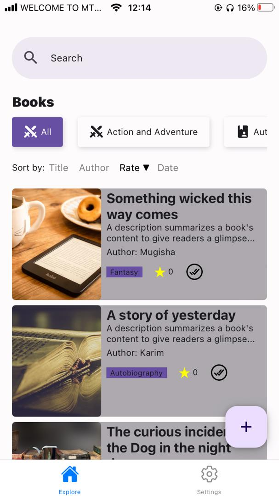
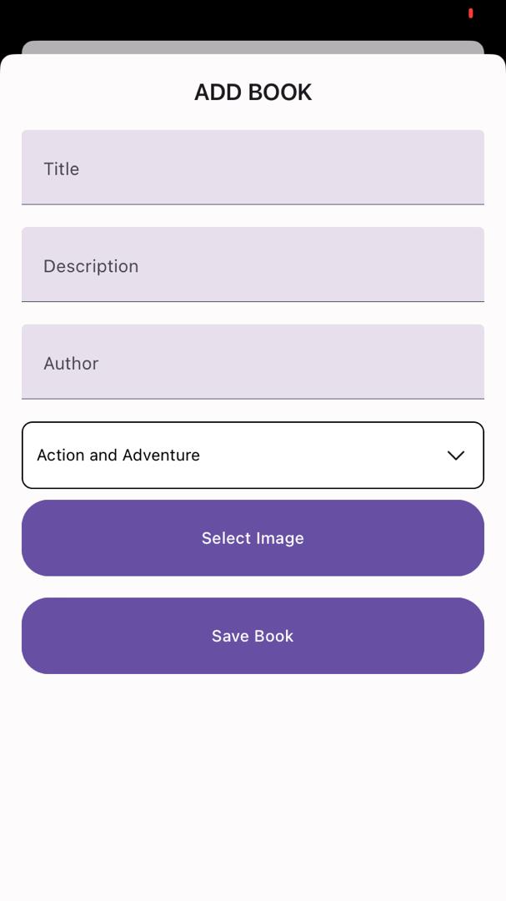
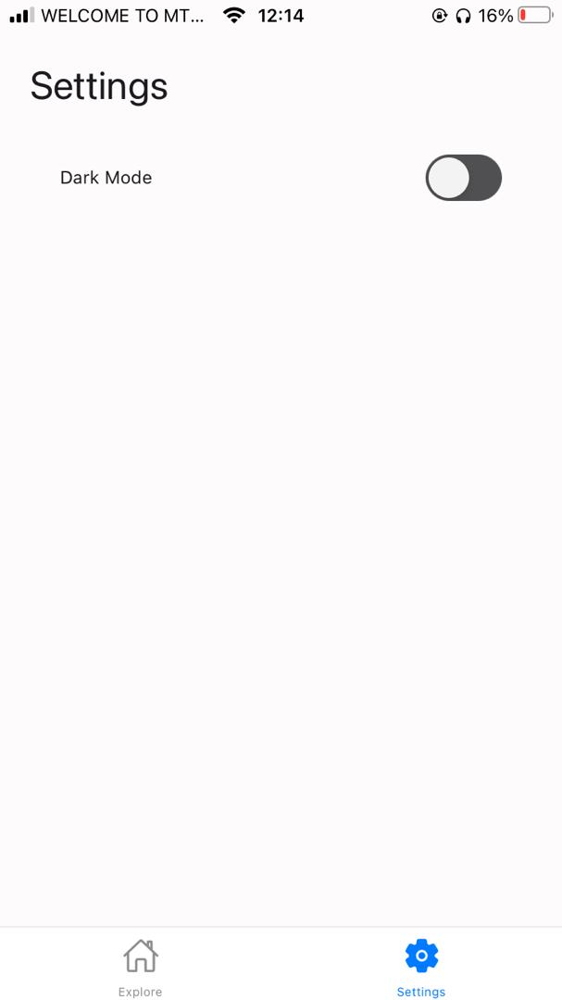
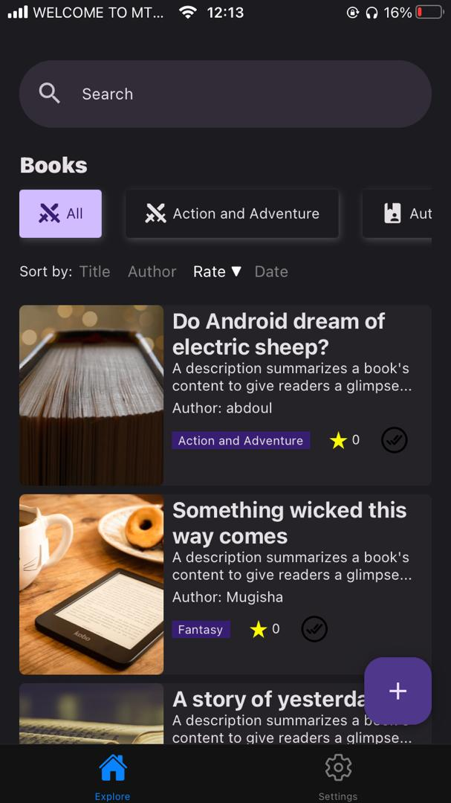
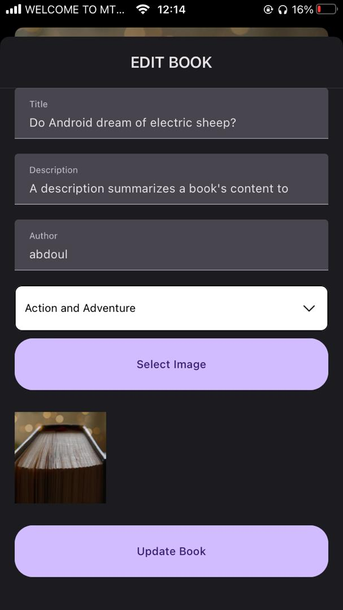
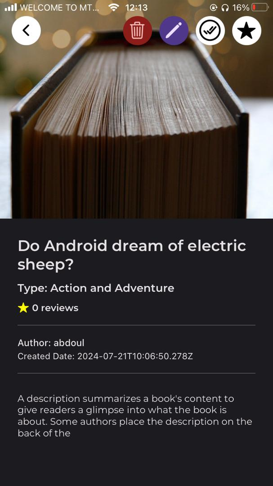
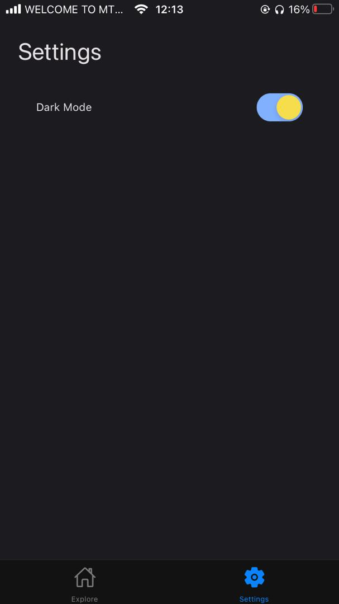

# Book Library App

A cross-platform mobile application developed using React Native for managing a personal book library. The app allows users to add, edit, delete, and view books. Users can also rate books and mark them as read or unread. Preferences like sorting order are stored using shared preferences.

## Features

- **Add Books**: Users can add new books to their library with details such as title, author, description, and image.
- **Edit Books**: Modify existing book details.
- **Delete Books**: Remove books from the library.
- **View Books**: Display a list of books with their details.
- **Rate Books**: Users can rate books and view their ratings.
- **Mark as Read/Unread**: Track whether books have been read or not.
- **Sort Books**: Sort the book list based on title, author, rating, or date in ascending or descending order.
- **Filter Books**: Filter books by category and search by title, author, or description.
- **Favorite Books**: Filter books to show only those marked as favorites.
- **User Preferences**: Store sorting order and other preferences using Shared Preferences.

## Screenshots

### Light mode







### Dark mode







## Getting Started

1. Clone the Repository

   ```bash
   git clone https://github.com/your-username/book-library-app.git
   cd book-library-app
   ```

2. Install dependencies

   ```bash
   npm install
   ```

3. Start the app

   ```bash
    npx expo start
   ```

4. Open the App

   - Scan the QR code with the Expo Go app (available on iOS and Android) to run the app on your mobile device.
   - Alternatively, run the app on an Android/iOS emulator.